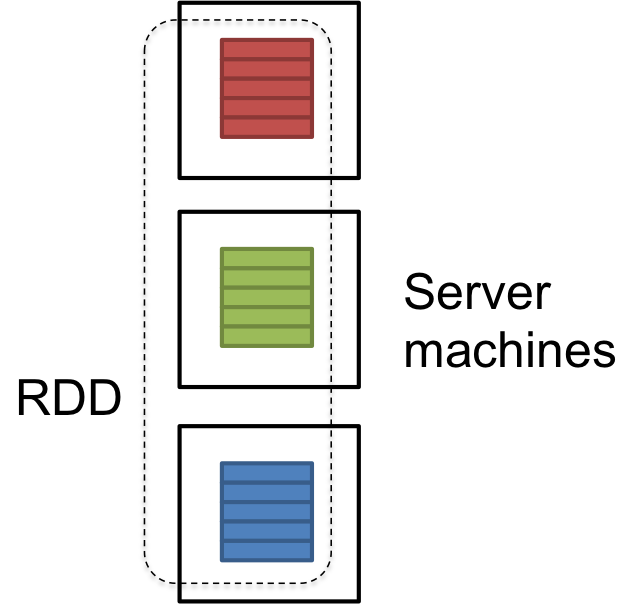
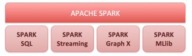
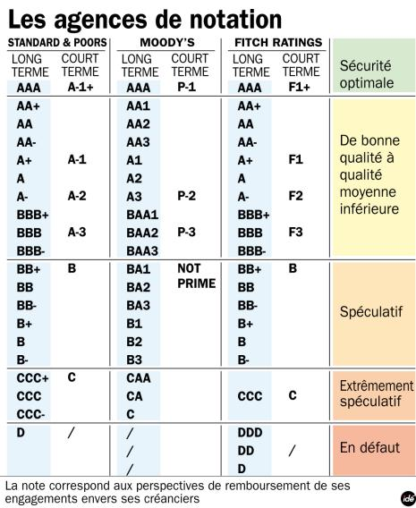
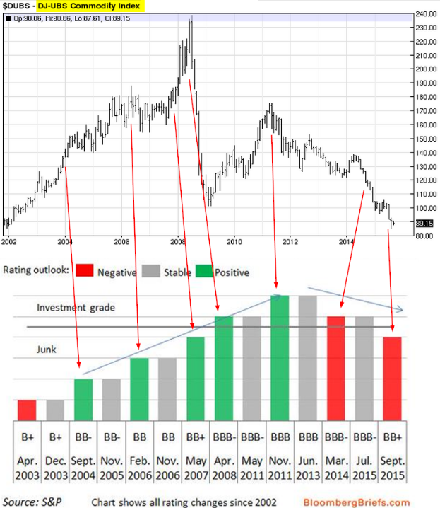

# Apache Spark


Apache Spark™ is a unified analytics engine for large-scale data processing.

In theory, it's a much faster than Hadoop for machine learning. We can use it with Scala, Java, Python and R. It has been developped at Berkley University for big data analysis.

Spark execute the totality of its data operation in the memory in real time. It will use the hard disk when there is no more available memory. In theory, it's much faster than hadoop with mapReduce technology.

## 1. Cluster overview


Spark applications run as independent sets of processes on a cluster, coordinated by the SparkContext in the main program. The SparkContext can connect to several types of cluster managers (either Spark’s own standalone cluster manager, Mesos or YARN), which allocate resources across applications.

Unfortunately, using spark throught this cluster has a cost.. This is the reason why, we will use spark in a local environment ! 

{width=250px}

Spark manage data throught Resilient Distributed Dataset ``RDD``. Data are split on different server machines and you can use ``dplyr`` package function to transform data as you wish.

## 2. Spark Tools



There is 4 main tools in Apache Spark:

1. Spark SQL: for charging, executing, transforming data, via SQL
2. Spark streaming: for executing flows data in real time. It is used by Twitter and Amazon.
3. Spark Graph X: for treatment of graph data.
4. Spark MLlib: for machine learning


# Data presentation

We decided to focus on economic meaning more than on the big data part.
Our X variables are financial data on brazil (interest rate, exchange rate, price index and export figures). 

1. Delinquency Interest Rate on Fines Applied by Banco Central
2. Referencial interest rate 
3. Exchange rate, Free, United States dollar
4. Brazilian Agribusiness Price Indices - Arabica Coffee
5. Brazilian Agribusiness Price Indices - Anhydrous Ethanol Sao Paulo State
6. Brazilian Real Futures, Continuous Contract
7. Fuel oil export
8. NASDAQ Brazil Utilities AUD Index

```{r packages, message=FALSE, warning=FALSE, include=FALSE}
setwd("~/Documents/github/r")
library(tidyverse)
library(caret)
library(ggplot2)
library(dplyr)
library("Quandl")
library(tidyr)
library(sparklyr)
```

## 1. Quandl data: X variables
 
```{r données, cache=TRUE}
Quandl.api_key("hxZggp6eP-7YbyasrCry")
data = Quandl(c("BCB/12501","BCB/7812","BCB/10813","CEPEA/COFFEE_A.1",
                "CEPEA/ETHANOL_AS.1","CHRIS/CME_BR1.1",
                "JODI/OIL_RSEXKT_BRA.1","NASDAQOMX/NQBR7000AUD.1"),
              start_date="1990-01-01", end_date="2017-05-01", collapse="monthly")
 # 20% de NA dans les données
```

```{r, dependson="données", results="hide"}
round(sum(is.na(data)) / (ncol(data) * nrow(data)),digits=2)
```

There is `r round(100 * sum(is.na(data)) / (ncol(data) * nrow(data)),digits=2)` % missing data

## 2. Y variable: Fitch or Moody's notation

We transform country notation into grades from factor 0 to 20. Brazil has grade 6 to 12 from january 1990 to may 2017.




```{r données rating}
rating<-read.csv("file/RatingBrazil.csv", header=FALSE, sep=";")
names(rating)<-c("date","fitch","sp")
data$y<-rating$fitch 
data$y <- data$y %>% as.factor()
data<-data %>%
  drop_na() # remove every lines with NA
levels(data$y)
```

# Spark environment 

There is plenty of parameters you can change in the spark environnement when you have access to a cluster. In the local environment, you can select the number of cores and the maximum memory spark can use.

```{r}
conf <- spark_config()
conf$`sparklyr.cores.local` <- 2
conf$`sparklyr.shell.driver-memory` <- "8G"
conf$spark.memory.fraction <- 0.9
sc <- spark_connect(master = "local",
                    version = "2.3.2",
                    config = conf)
```
Once the spark context ``sc`` is created, you have to import you data in spark environment with ``sdf_copy_to`` function. 

``repartition`` is the number of partitions to use when distributing the table across the Spark cluster.

Then, we split the data set into a training and a test data set.

```{r}
data_tbl <- sdf_copy_to(sc, data, name = "data_tbl", overwrite = TRUE,repartition = 2)


partitions <- data_tbl %>%
  sdf_partition(training = 0.7, test = 0.3)

data_training <- partitions$training
data_test <- partitions$test
```

## 1. Random forest

We just have to use ``ml_random_forest`` function from ``MLlib``
```{r}
rf_model <- data_training %>%
  ml_random_forest(y ~ ., type = "classification")


pred <- sdf_predict(data_test, rf_model)
ml_multiclass_classification_evaluator(pred)
```

If you want to obtain the confusion matrix, you will have to use ``caret``. First, you transform your data into dataframe with ``collect``, and then you use ``confusionMatrix`` from caret.

```{r}
data_test_df <- collect(data_test)
data_pred_df<- collect(pred)

data_test_df <- data_test_df$y %>% as.factor()
data_pred_df <- data_pred_df$predicted_label %>% as.factor()
confusionMatrix(data = data_pred_df, reference = data_test_df)
```

A plot could be nice in your case, we transform our data into a tibble object and then plot our data with ``ggplot2``

```{r}
dataplot<- tibble(data_pred_df,data_test_df)
dataplot<-dataplot %>%
  group_by(data_pred_df,data_test_df)%>%
  count()

dataplot %>%
  ggplot(aes(data_pred_df,data_test_df))+
  geom_point(aes(size=n))+
  labs(title = "Prediction", subtitle = "Random forest")+
  xlab("prediction")+
  ylab("real value")
```

## 2. Decision Tree

We obviously can use the same process for decision tree, but let's just focus on prediction:

```{r}
dt_model <- data_training %>%
  ml_decision_tree(y ~ ., type = "classification")
pred <- sdf_predict(data_test, dt_model)
ml_multiclass_classification_evaluator(pred)
```

## 3. kmeans
```{r}
kmeans_model <- ml_kmeans(data_training, formula = y~.,k=7)
pred_kmeans <- sdf_predict(data_test, kmeans_model)
ml_clustering_evaluator(pred_kmeans)
```


## Validation data
```{r}
ml_models <- list(
  "K_Means" = kmeans_model,
  "Decision Tree" = dt_model,
  "Random Forest" = rf_model)


score_test_data <- function(model, data = data_test){
  pred <- sdf_predict(data, model)
  select(pred, prediction)
}

ml_score <- map(ml_models, score_test_data)


```

Be careful, you should always remember to disconnect your spark session after your computation:

```{r}
spark_disconnect(sc)
```


```{r, include=FALSE}
data<-data %>%
  select(-Date)
names(data)<-c("Ir delinquency","Ir central bank","Exchange rate","price coffee","price Ethanol","Real Futures","Fuel export","Nasdaq brazil", "y" )

names(data)
library(shiny)
ui <- pageWithSidebar(
  headerPanel('Iris k-means clustering'),
  sidebarPanel(
    selectInput('xcol', 'X Variable', names(data)[-9]),
    selectInput('ycol', 'Y Variable', names(data)[-9],
                selected=names(iris)[[2]]),
    numericInput('clusters', 'Cluster count', 7,
                 min = 1, max = 8)
  ),
  mainPanel(
    plotOutput('plot1')
  )
)

server <- function(input,output){
  selectedData<-reactive({ 
    data[,c(input$xcol,input$ycol)]
    })
  
  clusters<-reactive({
    kmeans(selectedData(),input$clusters)
  })
  
  output$plot1<- renderPlot({
    palette(c("#E41A1C", "#377EB8", "#4DAF4A", "#984EA3",
      "#FF7F00", "#FFFF33", "#A65628", "#F781BF"))
    
        plot(selectedData(),
         col = clusters()$cluster,
         pch = 20, cex = 3)
    points(clusters()$centers, pch = 4, cex = 4, lwd = 4)
  })
}

shinyApp(ui=ui,server=server)
```


```{r}
data %>% 
  ggplot(aes(`Ir delinquency`,`Ir central bank`))+
  geom_point(aes(color=y))
```


```{r}
data %>%
  ggplot(aes(`Ir delinquency`,fill=y,color=y))+
  geom_density(alpha = 0.1)
```


```{r}
library(GGally)
GGally::ggpairs(data[,c(1,2,9)],ggplot2::aes(colour=y,alpha = 0.1))
```

```{r}
devtools::session_info()
```

